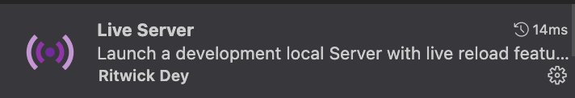

<!-- PROJECT LOGO -->
<div id="readme-top" align="center">
<div >

</div>

<h1 align="center">
    JS Clock
</h1>
<p align="center">
    A modern and minimalist watch
    <br />
</p>

<p align="center">
<a href="#about-the-project">About The Project</a>
&nbsp;&nbsp;&nbsp;&nbsp;|&nbsp;&nbsp;&nbsp;
<a href="#built-with">Built With</a>&nbsp;&nbsp;&nbsp;&nbsp;|&nbsp;&nbsp;&nbsp;
<a href="#getting-started">Getting Started</a>&nbsp;&nbsp;&nbsp;&nbsp;|&nbsp;&nbsp;&nbsp;
 <a href="#usage">Usage</a>&nbsp;&nbsp;&nbsp;&nbsp;|&nbsp;&nbsp;&nbsp;
 <a href="#project-tree">Project Tree</a>&nbsp;&nbsp;&nbsp;&nbsp;|&nbsp;&nbsp;&nbsp;
 <a href="#usage">Acknowledgments</a>&nbsp;&nbsp;&nbsp;&nbsp;
</p>

<p align="center">
</img>
</p>
</div>

<!-- ABOUT THE PROJECT -->

## About The Project test

![Product Name Screen Shot][product-screenshot] A useful project for practicing instances of `Date` from javascript. On websites it is usually used for promotion countdowns, but here it was useful to create an elegant clock that you can leave open as a background image.Differentials:

- Responsiveness
- JS language - Date constructor
- Very elegant design

<p align="right"><a href="#readme-top">back to top</a></p>

<!-- BUILT WITH -->

## Built With

This section should list any major frameworks/libraries used in project.

- ![HTML5]
- ![CSS3]
- ![JS]

<p align="right"><a href="#readme-top">back to top</a></p>

<!-- GETTING STARTED -->

## Getting Started

These instructions provide a clear and simple step-by-step, which is intended to help users understand accessing and configuring.

1. Clone the repo

   ```sh
   git clone https://github.com/cristianmeelo/js-app-digital-clock

   ```

2. Install extension live server in vscode</br> 

3. Run the project by clicking on `Go Live` in the lower right corner <br/> 

<p align="right"><a href="#readme-top">back to top</a></p>

<!-- USAGE EXAMPLES -->

## Usage

It's not just the functionality that makes digital watches so special. Their vivid, contemporary looks also make them a popular choice with design enthusiasts. With its sleek, futuristic aesthetic, a digital clock adds a modern touch to any space. </br> ` - chat GPT`

<div align="center">
<a href="http://cristianmeelo4.com.s3-website-sa-east-1.amazonaws.com/">

</div>

<div align="center">

</div>
</br>

<p align="right"><a href="#readme-top">back to top</a></p>

<!-- PROJECT  Tree -->

## Project Tree

```
js-app-digital-clock
├─ README.md
├─ assets
│  ├─ go-live.png
│  ├─ image-site.png
│  └─ live-server.png
├─ index.html
├─ js
│  └─ script.js
└─ styles
   └─ css
      └─ styles.css

```

<p align="right"><a href="#readme-top">back to top</a></p>

<!-- ACKNOWLEDGMENTS -->

## Acknowledgments

This space list helpful resources and credits.

- [Date Object][referencial-doc]
- [Video Tutorial][tutorial-video]
- [Github Larissa Kich][partner-github]

<p align="right"><a href="#readme-top">back to top</a></p>

<p align="center">
.
<br/>
.
<br/>
.
<br/>
.
<br/>
<br/>
with ❤️
<a href="https://www.linkedin.com/in/cristian-melo/">
 Cristian Melo
</a>
</p>
</div>

<!-- MARKDOWN LINKS & IMAGES -->
<!-- https://www.markdownguide.org/basic-syntax/#reference-style-links -->

<!-- IMAGES -->

[product-screenshot]: https://images.unsplash.com/photo-1524592094714-0f0654e20314?ixlib=rb-4.0.3&ixid=MnwxMjA3fDB8MHxwaG90by1wYWdlfHx8fGVufDB8fHx8&auto=format&fit=crop&w=1598&q=80

<!-- LINKS -->

[referencial-doc]: https://developer.mozilla.org/pt-BR/docs/Web/JavaScript/Reference/Global_Objects/Date
[tutorial-video]: https://www.youtube.com/watch?v=GK0ok3ZCXwM&t=1s
[partner-github]: https://github.com/Larissakich/relogiodigital

<!-- SHIELDS -->

[HTML5]: https://img.shields.io/badge/HTML5-E34F26?style=for-the-badge&logo=html5&logoColor=white
[CSS3]: https://img.shields.io/badge/css3-%231572B6.svg?style=for-the-badge&logo=css3&logoColor=white
[JS]: https://img.shields.io/badge/JavaScript-F7DF1E?style=for-the-badge&logo=javascript&logoColor=black
