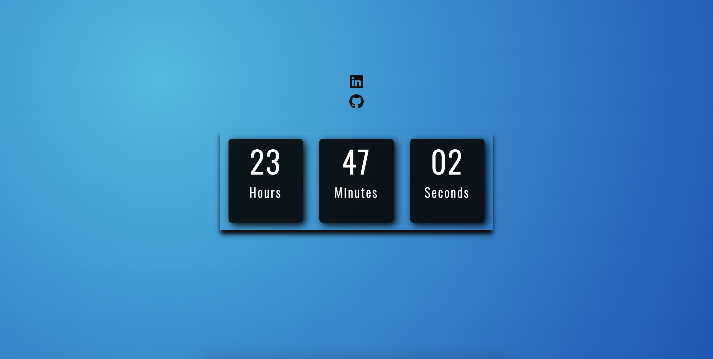

<table align="right">
  <tr>
    <td>
      <a href="README-en.md">🇺🇸 English (apenas no GitHub)</a>
    </td>
  </tr>
  <tr>
    <td>
      <a href="README.md">🇧🇷 Português</a>
    </td>
  </tr>
</table>

# Digital Clock

As principais funcionalidade é informar as horas de modo elegantíssimo, sendo uma altenativa para imagem de fundo.

## 🔨 Recursos do projeto

Não é apenas a funcionalidade que torna os relógios digitais tão especiais. Sua aparência vívida e contemporânea também os torna uma escolha popular entre os entusiastas do design. Com sua estética elegante e futurista, um relógio digital adiciona um toque moderno a qualquer espaço.

## ⚙️ Técnicas e tecnologias usadas

Confira essa lista de tudo que vamos usar nesse app:

- `HTML`
- `CSS`
- `Javascript`
- `AWS Deployment`
- `GitHub`

## 🛠️ Abra e execute o projeto

Para abrir e executar o projeto, adicione a extensão Live Server, clique no botão Go Live geralmente localizado no canto inferior direito se você estiver usando o vscode.

Em seguida, vá para http://127.0.0.1:5500/ em seu navegador.

## 📚 Mais informações do tutorial

O DigitalClock é um aplicativo para consulta de perfis do github, desenvolvido a partir do tutorial [Matheus Battisti](https://www.youtube.com/@MatheusBattisti). A ideia principal desse tutorial de implementação é aprender e desenvolver os conceitos de typescript, uma linguagem de programação que está sendo exigida pelo mercado, e sinceramente, me sinto mais confortável em usar do que não usar, mas demora um pouco para entender a profundidade de sua usabilidade. O sistema de roteamento do React geralmente é usado com react-router,mas existem algumas particularidades entre suas versões, e aprender novas formas de arquitetar um projeto fortalece muito nossa bagagem.

| :placard: Vitrine.Dev |                                                                      |
| --------------------- | -------------------------------------------------------------------- |
| :sparkles: Nome       | **Digital Clock **                                                   |
| :label: Tecnologias   | HTML, CSS, JavaScript,AWS Deployment,GitHub (tecnologias utilizadas) |
| :rocket: URL          | http://cristianmeelo4.com.s3-website-sa-east-1.amazonaws.com/        |
| :fire: Desafio        | https://www.youtube.com/watch?v=GK0ok3ZCXwM&t=1s                     |
