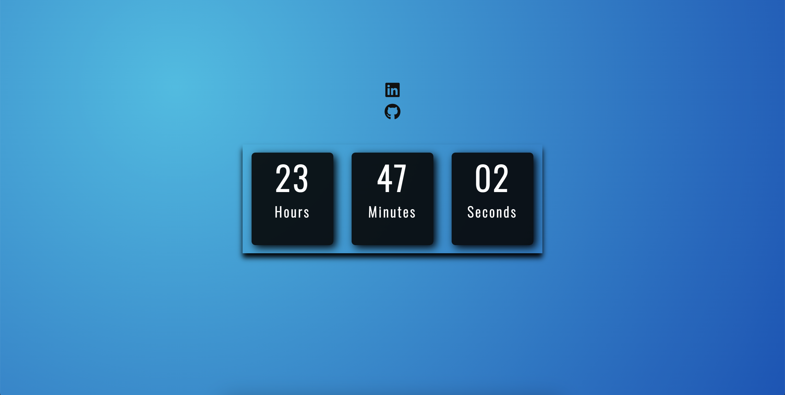

<table align="right">
  <tr>
    <td>
      <a href="README-en.md">🇺🇸 English (only in GitHub)</a>
    </td>
  </tr>
  <tr>
    <td>
      <a href="README.md">🇧🇷 Português</a>
    </td>
  </tr>
</table>

# Digital Clock

The main functionality is to tell the time in a very elegant way, being an alternative to the background image:

## 🔨 Project features

It's not just the functionality that makes digital watches so special. Their vivid, contemporary looks also make them a popular choice with design enthusiasts. With its sleek, futuristic aesthetic, a digital clock adds a modern touch to any space.

## ⚙️ Techniques and technologies used

Check out this list of everything we will use in this app:

- `HTML`
- `CSS`
- `Javascript`
- `AWS Deployment`
- `GitHub`

## 🛠️ Open and run the project

To open and run the project, add the Live Server extension, click on the Go Live button usually located in the lower right corner if you are using vscode.

Then go to http://127.0.0.1:5500/ in your browser.

## 📚 More tutorial information

A useful project for practicing instances of `Date` from javascript. On websites it is usually used for promotion countdowns, but here it was useful to create an elegant clock that you can leave open as a background image.Differentials: developed from the tutorial [Larissa Kich](https://github.com/Larissakich/relogiodigital).

| :placard: Vitrine.Dev |                                                                   |
| --------------------- | ----------------------------------------------------------------- |
| :sparkles: Name       | **Digital Clock**                                                 |
| :label: Technologies  | HTML, CSS, JavaScript,AWS Deployment,GitHub ( used Technologies)  |
| :rocket: URL          | http://cristianmeelo4.com.s3-website-sa-east-1.amazonaws.com/app/ |
| :fire: Challenge      | https://www.youtube.com/watch?v=GK0ok3ZCXwM&t=1s                  |
